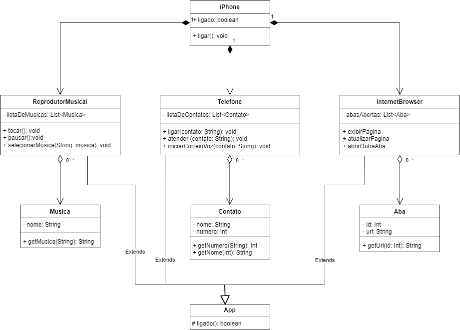

# Lab DIO - iPhone com Java
Repositório para guardar o meu resultado do Lab da DIO para o bootcamp Santander Fullstack Java + Angular, cujo objetivo é simular um iPhone (2007) com classes Java e orientação a objetos.

### Java do VSCode
Eu já tinha instalado o VSCode no meu computador, então o que eu fiz foi simplesmente instalar a extensão ```Extension Pack for Java``` direto no programa. Logo na instalação, foi-me pedido para instalar também a JDK, o que imagino seja necessário para o uso da extensão.

No entanto, conforme dito em aula, é possível baixar o VS Code já com as configurações para o Java [aqui](https://code.visualstudio.com/docs/languages/java).

## Sobre o desafio
O desafio é usar classes Java para criar simulações das funcionalidades apresentadas no lançamento iPhone, em 2007. É recomendado que vejamos [este vídeo](https://youtu.be/9ou608QQRq8?si=3IOee4rlS-VAdvFn&t=900). Uma descrição do desafio pode ser encontrada [aqui](https://youtu.be/9ou608QQRq8?si=3IOee4rlS-VAdvFn&t=900).

## Resultados esperados:
* Diagramação em UML (linguagem de modelagem unificada) do componente iPhone;
* Repodutor Musicial: tocar, pausar, selecionarMusica
* Aparelho Telefônico: ligar, atender, iniciarCorreioVoz
* Navegador na Internet: exibirPagina, adicionarNovaAba, atualizarPagina

### Diagramação em UML
Para esta parte do desafio, escolhi o draw.io, e a execução/resultado pode ser visto [aqui](https://drive.google.com/file/d/1X_Ign_NFENfF-UvFzY4-bnUo7m4YYKTh/view?usp=sharing).

